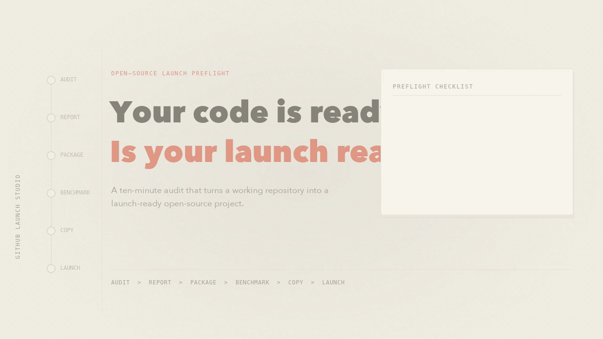
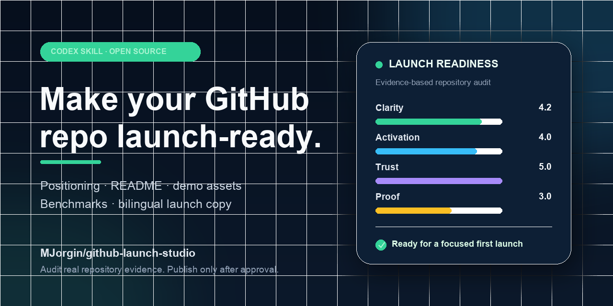

# GitHub Launch Studio

[English](./README.md) · **简体中文**

一个把“代码能跑”的仓库包装成“适合公开发布”的开源项目的 Codex Skill。

它会帮你完成项目定位、README 和快速上手改造、演示素材策划、中英文发布文案与发布检查清单。重点是真实可验证的采用路径，不做刷星、虚假背书或群发营销。

[](./assets/launch-demo.mp4)

*30 秒流程：仓库体检、Markdown 报告、发布包装、对标地图和中英文文案。*



**体检 → 定位 → 对标 → 包装 → 演示 → 发布**

## 适合什么场景

- 第一次把项目发布到 GitHub；
- 准备重要版本发布；
- 项目已经能用，但别人看不懂、不想试、不敢用；
- 需要截图、30 秒 GIF、演示视频或社交卡片；
- 中文开发者要把项目发到英文社区。

### 示例请求

```text
帮我审计这个仓库现在适不适合发布。
把这个 README 改成适合国际开发者的开源发布版。
给 v1.0 做 GitHub、X、V2EX、即刻的中英文发布包。
为这个 CLI 设计一个 30 秒 GIF 分镜。
帮我列一份下周发布前必须完成的清单。
```

## 会产出什么

- 基于仓库证据的 6 个评分：清晰度、激活率、证明、信任、传播性、维护准备；
- 目标用户、五分钟价值、差异化和非目标边界；
- README 工具、Release 自动化、Changelog、数据分析和 Agent 工作流的真实对标地图；
- README、Quick Start、示例、限制说明和反馈路径改造建议；
- 截图、GIF、视频和社交卡片的素材简报；
- GitHub Release 和各平台的中英文发布文案；
- 密钥、权限、分支保护、CI、发布后问题分流等检查项。

## 和其他工具的关系

GitHub Launch Studio 不和 Release 自动化硬碰硬，而是补齐“发布策略和包装”这一层：

| 工具类型 | 强项 | GitHub Launch Studio 补上的部分 |
| --- | --- | --- |
| README 编辑器 | 拼装和排版 README 区块 | 定位、证据、快速上手质量和发布叙事 |
| Profile README 生成器 | 个人主页组件 | 面向项目发布，而不是个人主页 |
| semantic-release / release-please / git-cliff / Changesets | 版本、Changelog、Release PR 和发包 | 面向人的发布故事、Demo、中英文案和渠道计划 |
| Star History | 发布后的 Star 趋势 | 发布前的激活和传播准备 |
| Agent 规格/工作流工具包 | 结构化开发流程 | 专注开源发布增长工作流 |

完整数据见 [英文对标地图](./docs/BENCHMARKS.md) / [中文对标说明](./docs/BENCHMARKS.zh-CN.md)。指标带有观察日期，也可以用脚本刷新。

## 安装

仓库发布后：

```bash
git clone https://github.com/MJorgin/github-launch-studio.git \
  ~/.codex/skills/github-launch-studio
```

本地开发时，也可以把当前文件夹复制或软链接到 Codex skills 目录，然后重启或重载 Codex。

## 本地仓库体检

内置脚本离线运行，不会打印密钥文件内容。扫描过程本身是只读的；只有传入 `--output` 时才会写入报告文件：

```bash
python3 ~/.codex/skills/github-launch-studio/scripts/repo_audit.py /path/to/repository --pretty
```

生成适合分享的 Markdown 报告：

```bash
python3 scripts/repo_audit.py /path/to/repository \
  --format markdown \
  --output /path/to/repository/LAUNCH.md
```

它会检查：

- README、LICENSE、文档、示例、依赖清单和工作流；
- 安装/快速开始标题、代码块、图片、徽章和失效相对链接；
- Issue 模板、贡献指南、安全策略、Roadmap/Changelog；
- 疑似密钥文件名；
- 0-5 分的初步发布就绪度和优先问题。

分数只是启发式信号。真正的定位、文案和发布策略还需要结合项目内容做语义判断。

## 发布工具包

- [30 秒演示视频](./assets/launch-demo.mp4) / [动态 GIF](./assets/launch-demo.gif)：已渲染好的 README 演示。
- [30 秒 Demo 分镜](./docs/demo-storyboard.md)：录制计划、字幕和发布前检查。
- [待审发布文案](./docs/launch-posts.md)：X、V2EX、即刻草稿，确认前不会自动发布。

## 刷新对标数据

```bash
python3 scripts/benchmark_github.py \
  --config benchmarks/representative-tools.json \
  --format markdown
```

该脚本使用 GitHub 公开 API；如遇限流可设置 `GITHUB_TOKEN`，脚本不会打印 token。

## 重新生成社交卡片

仓库已包含渲染好的 `assets/social-card.png`。本地重新生成：

```bash
python3 -m pip install pillow
python3 scripts/render_social_card.py --output assets/social-card.png
```

## 重新生成 Demo

这个可复现 Demo 依赖 [Pillow](https://pillow.readthedocs.io/) 和 `ffmpeg`：

```bash
python3 -m pip install pillow
python3 scripts/render_launch_demo.py
```

脚本会生成 `assets/launch-demo.mp4` 和 `assets/launch-demo.gif`，不录制桌面，也不会暴露本机终端路径。

## 工作方式

1. 用文件和 Git 元数据做证据化体检；
2. 明确目标用户、五分钟结果、可信证据和替代方案；
3. 改造访客转化路径：Hero、Quick Start、示例、限制和反馈入口；
4. 设计最小但有说服力的演示素材；
5. 准备中英文 Release Notes 和分平台文案；
6. 验证干净环境安装路径，并在明确授权后才发布。

完整规则见 [SKILL.md](./SKILL.md)，详细方法见 [references](./references)。

## 安全边界

- 体检脚本不访问网络；
- 本地草稿和外部发布严格分开；
- 创建 GitHub Release、修改仓库设置、发布社交内容、社区评论或私信，都需要单独确认；
- 不做刷星、虚假用户评价、未披露付费推广、群发私信、抓取联系方式或伪造数据。

## Roadmap

- 可选的 Markdown 体检报告输出；
- 支持更多语言生态和干净安装探测；
- 高质量开源项目发布案例拆解；
- 常见技术生态的中英文 Release Notes 模板。

## 贡献与安全

请见 [CONTRIBUTING.md](./CONTRIBUTING.md) 和 [SECURITY.md](./SECURITY.md)。


## 相关 skill

- [preflight-decks](https://github.com/MJorgin/preflight-decks)：概念先行的 HTML 幻灯片导演——硬概念门、三版真实视觉方向、双视口机械验收。同作者作品。

## 许可证

[MIT](./LICENSE)
